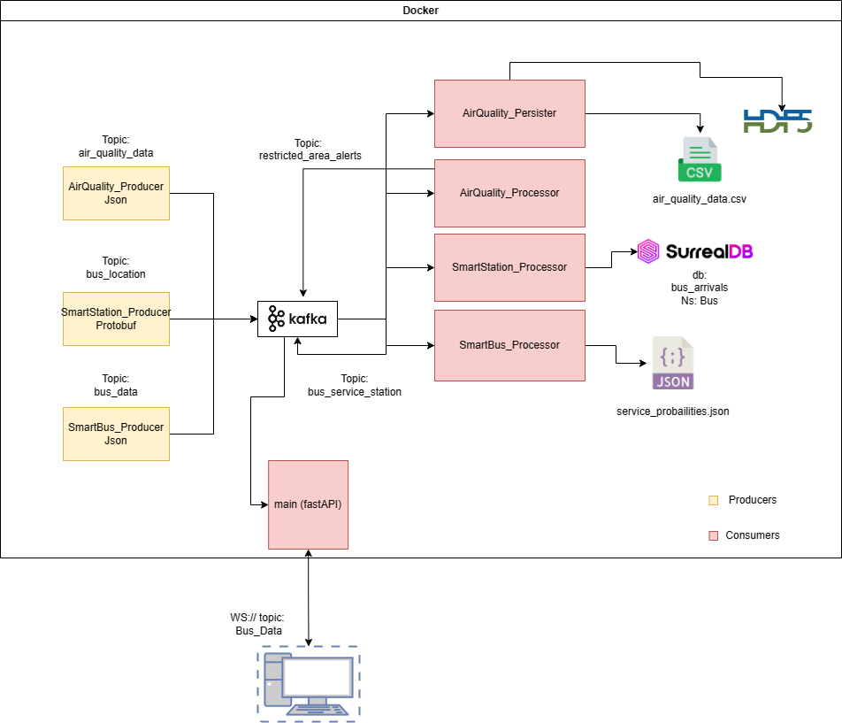
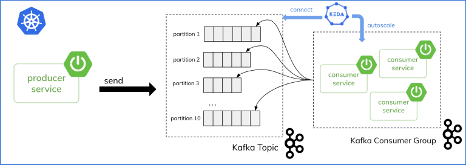
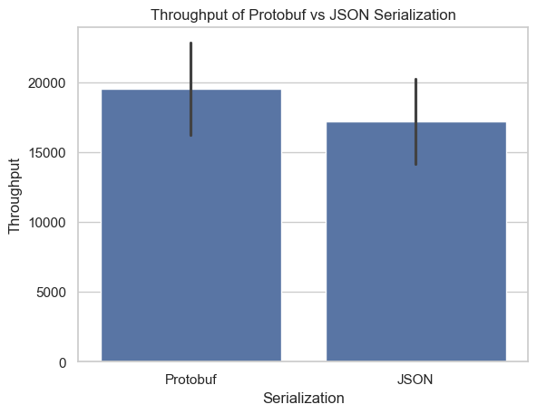
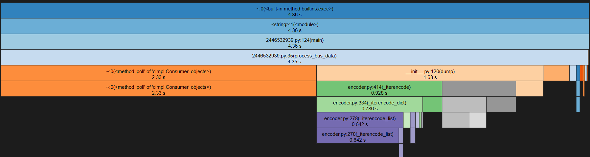
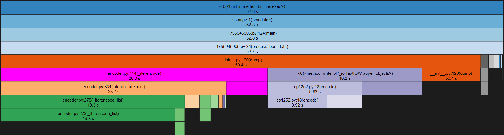
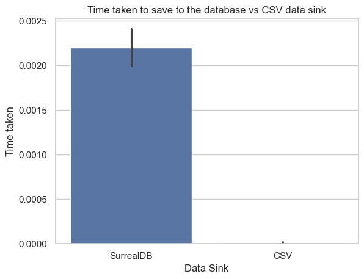
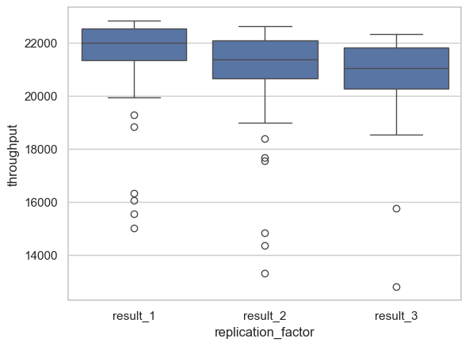
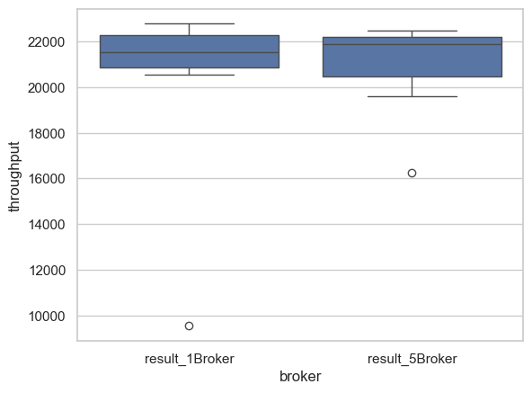

# Mini-Challenge 1 - High Performance Computing (hpc) FS24

## MiniChallenge Description:

Urban Mobility and Environmental Monitoring Suite

### Important Files:
- Kafka Application Dockercompose: [docker-compose.yml](./Application/docker-compose.yml)
- ZeroMQ Docker Compose: [docker-compose.yml](./Part3/ZeRoMQ/docker-compose.yml)
- ZenOH Docker Compose [docker-compose.yml](./Part3/ZeRoMQ/docker-compose.yml)
- Part2 Consumer Groups: [Groups](./Part2/SmartCity/Consumer%20Groups/docker-compose.generated.yml)
- Part2 Limt Bench: [Limit Bench](./Part2/SmartCity/Limit%20Bench/docker-compose.yml)
- Part2 Streams: [Streams Faust](./Part2/SmartCity/Streams/SmartBus_Consumer.py) 
- Part4 Performance Experiments: [Performance.ipynb](./Part4/Performance.ipynb)

**Python 3.11 used in Notebook and Python Scripts**
**Install the requirements.txt if you want to execute the Experiments**

### Overview:

At present, we are in the simulation phase, with plans to equip every bus with an Internet of Things (IoT) device in the future. These devices will utilize Kafka for data transmission, mirroring the SmartBus System's approach. Each bus will be outfitted with a single sensor, making it a node within a decentralized network. Although the final choice of the persistence layer remains undecided for the simulation and testing phase, we are considering several options, including CSV, HDF5, SurrealDB, and JSON.

Our comprehensive suite of applications, which includes SmartBus, AirQuality, and SmartStation, employs real-time data analytics to transform urban mobility and environmental monitoring. By drawing on data from diverse sources such as public transport systems and environmental sensors, our solutions are designed to improve urban life by enhancing transportation efficiency and promoting environmental health.

#### SmartBus System:
The SmartBus module is tasked with gathering and analyzing operational data from buses. This information is used to refine routing and elevate the passenger experience, streamlining urban transit.

#### AirQuality Monitoring:
The AirQuality application is dedicated to the collection, analysis, and storage of air quality data from sensors deployed throughout urban areas. By pinpointing trends and pinpointing areas of concern, it plays a crucial role in fostering healthier urban environments.

#### SmartStation Management:
SmartStation focuses on compiling data related to station operations. This data is instrumental in optimizing service delivery and augmenting passenger satisfaction, ensuring a seamless transit experience.

#### Infrastructure and Deployment:
Our deployment strategy, encapsulated within a docker-compose.yml configuration, guarantees streamlined deployment and scalability. This setup simplifies maintenance and supports the growth of our solutions, ensuring they can adapt and expand to meet future demands.

This document has been reviewed and improved for professional presentation, ensuring clarity and coherence in conveying the strategic direction and technological underpinnings of our initiatives.

### Intro to Kafka using Docker containers

- For each Consumer and Producer and Processor there is a Dockerfile.
- Each Consumer and Producer has its own Docker Container.

### Component Tasks

- **Producer Components** (SmartBus_Producer, AirQuality_Producer, SmartStation_Producer) collect real-time data from various sources such as buses, environmental sensors, and transport stations.
- **Processor Components** (SmartBus_Processor, AirQuality_Processor) analyze the collected data to identify patterns, optimizations, and insights relevant to their respective domains.
- **Consumer Component** (SmartStation_Consumer) likely acts on the analyzed data, implementing operational changes or notifications based on insights.
- **Persister Component** (AirQuality_Persister) saves processed data into a persistent storage system for historical analysis, reporting, and policy-making support.

### Component Interfaces

- **Producer and Processor Components** typically interface with data sources (e.g., sensors, GPS systems) to collect data, and with messaging systems like Kafka to publish this data.
- **Processor and Consumer Components** consume data from Kafka topics, process it, and possibly publish results to other topics or act directly based on the insights.
- **Persister Components** interface with databases or data lakes, consuming data from Kafka topics to store it.

### Rationale for Component Selection

- **Kafka** is chosen for its performance in handling high-throughput, real-time data streams. Its ability to decouple data producers from consumers improves system resilience and scalability.
- **Docker** facilitates deployment and ensures consistency across different environments, addressing the "it works on my machine" problem.

### Design Decisions and Requirements

- The architecture likely employs a microservices design pattern, enhancing scalability and allowing independent deployment of components.
- **Libraries**: The Python scripts may utilize libraries like `confluent-kafka` was choose because its faster than the normal lib for Kafka integration and `pandas` or `numpy` for data processing.
- **Kafka Clusters/Topics**: The choice of topics and cluster configurations would be driven by the need to efficiently segregate and manage data streams for different purposes (e.g., raw data streams, processed insights).

### Kafka Features and Configuration

- **Topics**: Separate topics for raw data, processed data, and alerts/notifications ensure organized data flow and consumption. (All Topics see Diagram)
- **Partitions**: Increased partitions per topic to support high throughput and parallel processing.
- **Consumer Groups**: Enables multiple consumers to process data in parallel, enhancing speed and efficiency.

### Docker Setup

- **Containerized Applications**: Each component (producer, processor, consumer, persister) runs in its own container, ensuring isolation and easy scalability.
- **docker-compose.yml**: Specifies the service configuration, including container images, network settings, and dependencies among services. It likely defines Kafka and database services alongside the application components, facilitating local development and testing.
- **Volumes**: For data persistence (e.g., Kafka data, databases) and to maintain state across container restarts.
- **Networks**: Custom networks may be configured to facilitate secure and efficient communication among the containers.

- See Folder Application!!.

## Part 1:

#### Solution:
Please refer to the "Part1" folder. The containerization process is scheduled for a later stage.

#### Bonus 1:
Opt for more efficient serializers/deserializers than JSON for message handling.

#### Bonus Solution:
- Implemented Protobuf by creating a `smartbus.proto` file.
- Utilized the Protobuf Python CLI to convert the `.proto` file, generating `smartbus_pb2.py`. This Python conversion leverages Protobuf's static typing capabilities.

**Note:** For Kafka, ensure the presence of a "descriptors" folder, which contains the Protobuf descriptor file for converting serialized data into clear text (applicable only for Smartbus).

#### Reflection:
## Part 2:

### Solution - Consumer Groups:
- Refer to the "Part2" folder, showcasing the implementation of three identical consumers but under different consumer groups. This setup demonstrates how multiple consumers can manage a single topic from one partition effectively.
- The second experiment involved one consumer group managing three consumers and a single producer, but with the complexity of three partitions and offsets. This configuration underscores the scalability and parallel processing capabilities of Kafka, allowing for efficient handling of topic messages by different consumers.

### Solution - Streams:
- Leveraged the Faust framework for stream processing.
- Did not use Python data classes due to the implementation of Protobuf. However, `faust.Codec` was utilized for parsing Protobuf data.
- Conducted an experiment with Faust to manage consumption and perform computations at set intervals, alongside an agent for aggregations. This involved a distributed object key-value store, generating high-density alerts for bus data based on specific criteria.

#### Results:

In exploring the realms of real-time data streaming and processing, my journey with Faust and Kafka, centered around bus transportation data, has been insightful. The aim was to harness these technologies to better understand passenger dynamics and enhance urban mobility. Below are my reflections on this venture and the configurations explored in this complex streaming data landscape.

##### Custom Protobuf Codec:
The introduction of a custom Protobuf codec for serialization and deserialization was a crucial step. This ensured that bus data messages were efficiently handled, a necessity given the real-time demands of the application. This demonstrated Faust's adaptability in managing custom data formats, critical for my application's data transmission efficiency.

##### Average Passenger Count Computation:
A key objective was calculating the average passenger count across buses in 20-minute intervals (simulated as 20-second windows to suit the streaming data). This utilized Faust's stateful streaming capabilities, where a table maintained passenger counts for periodic average computation. This feature of Faust effectively showcased the application of windowing in stream processing.

#### Min/Max Passenger Count:
The exploration into tracking minimum and maximum passenger counts per bus revealed Faust's strength in executing complex stateful operations. By updating and accessing min/max metrics over time through tables, the importance of state management in stream processing was highlighted.

#### High-Density Alerts:
Generating alerts for buses exceeding 80% capacity underscored Faust's utility in conducting real-time analytics and alerting based on predefined conditions. This is pivotal in monitoring systems where immediate action is crucial.

#### Kafka and Faust Configurations:
Through varying data volumes and passenger count distributions, the resilience of the application to handle high-throughput data streams and the efficiency of Protobuf serialization were tested. These tests affirmed Faust's reliability and the significance of efficient serialization for scalability and response time of the application.

#### Broader Application Scenarios:
While my focus was urban transportation, the insights from these experiments with Faust and Kafka highlight their wide applicability in real-time data streaming and processing across different domains. Whether it’s for real-time public transport management or monitoring systems in various sectors, the potential for scalable, real-time streaming applications is vast.

Reflecting on this exploration, it's evident that Faust and Kafka provide a robust toolkit for delving into real-time streaming analytics. This journey not only illuminated aspects of urban mobility but also unveiled the extensive possibilities in domains where real-time data is crucial. However, for the real application, I decided against using this setup due to the specific needs of high-density alerts and table persistence not aligning with our project requirements.

### Solution Limit Find out the limits of send/receive of your application (and of Kafka in general)

I use gkoenig/kafka-producer-benchmark:0.1 for the overall Benchmark of 3 Brokers.

The Result can be seen: [result](./Part2/SmartCity/Limit%20Bench/output/) in the output folder of Part2 Limit Bench.
The Benchmarking Results of my Application can be found in the [result4](./Part4/Performance.ipynb) Notebook.

The Result was: ## 100000 records sent, 73909.830007 records/sec (72.18 MB/sec), 259.93 ms avg latency, 358.00 ms max latency, 263 ms 50th, 338 ms 95th, 353 ms 99th, 358 ms 99.9th.

And my Application: Sent 10000 messages in 0.56 seconds.
Throughput: 17703.65 messages per second. 

And Consumer: Subscribing to topic: bus_data for 1000 messages
Time taken by process_bus_data: 0.23707103729248047 seconds
Average execution time: 0.43481884002685545 seconds
Standard deviation of execution time: 0.5655954740747247 seconds

#### in General:
The limits of send/receive for your application and Kafka in general depend on several factors:

Hardware: The hardware (CPU, memory, network bandwidth) of the machines running your application and Kafka can significantly impact the send/receive limits. More powerful hardware can handle more messages.

Kafka Configuration: Kafka's performance can be tuned by adjusting various configuration parameters. For example, increasing the batch size can improve throughput but may increase latency.

Message Size: Larger messages take longer to send and receive, reducing the overall throughput. Smaller messages can be processed more quickly, increasing throughput.

Number of Topics/Partitions: More topics and partitions can increase parallelism and thus throughput, but they also require more resources to manage.

In general, Kafka is capable of handling hundreds of thousands to millions of messages per second, but the actual limit will depend on your specific setup and configuration.

## Part 3:

In the latest phase of development, I explored alternative communication frameworks to enhance the architecture of my application, focusing on ZeroMQ and ZenOH. This exploration was driven by the need for a more decentralized and flexible communication model, especially considering the distributed nature of the smart transportation system I am developing.

#### ZeroMQ Implementation:
ZeroMQ, an asynchronous messaging library, was integrated into the application, replacing the broker-based model previously in place. This choice was motivated by ZeroMQ's lightweight, brokerless architecture, which facilitates direct and efficient communication between distributed components without the overhead of a centralized broker. ZeroMQ's support for various communication patterns, such as publish-subscribe, request-reply, and push-pull, provided the flexibility needed to tailor communication flows to the specific requirements of different parts of the application, such as the SmartBus system.

#### Transition to ZenOH:
As an additional exploration, I rewrote portions of the application (excluding the Smartbus component) to utilize ZenOH. This decision was prompted by ZenOH's promising capabilities in edge computing and IoT scenarios, where efficient, low-latency communication across wide-area networks is crucial. However, integrating ZenOH presented challenges, primarily due to its limited documentation and the nascent state of its Python API, which contrasts with its more mature Rust API. Despite these hurdles, ZenOH's peer-to-peer communication model and advanced data routing and querying features presented a compelling alternative to Kafka for edge-focused applications.

### Reflections on ZeroMQ and ZenOH:

#### Kafka:
- **Communication Patterns:** Utilizes a publish-subscribe model, with producers sending messages to topics and consumers reading from those topics. Distinct from ZeroMQ and ZenOH, Kafka adds a distributed commit log for fault tolerance and message durability.
- **Advantages and Disadvantages:** Offers high throughput and scalability due to its distributed nature, but depends on ZooKeeper for coordination, introducing complexity and potential failure points.
- **Known Issues and Mitigation:** Can face latency under heavy loads, mitigated by efficient partitioning and load balancing.
- **Scalability:** Highly scalable in handling numerous messages and participants, yet demands meticulous planning for brokers and ZooKeeper instances.

#### ZeroMQ:
- **Communication Patterns:** Supports various patterns like request-reply, publish-subscribe, and push-pull, allowing for detailed control over data flow.
- **Advantages and Disadvantages:** Decentralized, avoiding centralized bottlenecks but necessitates more application-level management for reliable messaging.
- **Known Issues and Mitigation:** Lacks inherent message delivery guarantees, which can be addressed with acknowledgment messages or the ZMQ_REP/ZMQ_REQ pattern.
- **Scalability:** Extremely scalable due to its decentralized nature and small footprint, though managing state across components can be challenging.

#### ZenOH:
- **Communication Patterns:** Offers publish-subscribe pattern with added features for data routing and querying, facilitating advanced data-driven functionalities.
- **Advantages and Disadvantages:** Ideal for edge computing with low-latency communication and efficient data distribution, but limited by the maturity of its Python API and documentation.
- **Known Issues and Mitigation:** The complexity of implementing ZenOH-based solutions may slow down development, which can be countered with thorough testing and debugging.
- **Scalability:** Designed for scalability in distributed and edge computing environments, though affected by API maturity and data routing complexities.

### Moving to Kubernetes and Cloud-based Enhancements:

Transitioning to Kubernetes enhances our application infrastructure's scalability, resilience, and efficiency. This strategy leverages Kubernetes' orchestration capabilities and integrates SurrealDB for persistent storage, providing a robust solution for managing containerized applications.

#### Key Strategies:

- **Configuration Conversion:** Transition from Docker Compose to Kubernetes manifests to ensure seamless deployment in a Kubernetes environment.
- **Persistent Storage with SurrealDB:** Use SurrealDB, a cloud-native database, for Kubernetes deployments, ensuring data persistence and scalability.
- **Dynamic Scaling with KEDA:** Implement Kubernetes Event-Driven Autoscaling (KEDA) to scale applications based on Kafka lag metrics, ensuring resources match demand.

#### Benefits:

- **Scalability:** Dynamically scale services and Kafka brokers in response to demand, avoiding over-provisioning.
- **Resilience:** Leverage Kubernetes' self-healing features and SurrealDB's distributed nature for higher system availability.
- **Operational Efficiency:** Reduce manual management with cloud-native solutions like SurrealDB and managed Kafka services.

#### Cloud-Based Solutions:

- **Managed Kafka Services:** Consider using Confluent Kafka or Redpanda Serverless for scalable, maintenance-free messaging systems.
- **SurrealDB Integration:** Incorporate SurrealDB for a scalable, serverless database solution that seamlessly integrates with Kubernetes, enhancing data management and accessibility.

like:

The Important Faktor is the Lag, if its to high i would scale it up. Lag as a Metic.

Source I would follow through: [scaling](https://piotrminkowski.com/2022/01/18/autoscaling-on-kubernetes-with-keda-and-kafka/)
And for the Persitence: [persistence](https://surrealdb.com/docs/surrealdb/deployment/kubernetes)

But I have to say I am not a huge fan of cloud infostructure, in bigger companys the cost of Cloud is way to high as on premise solutions. I dont get the Cloud Hype since the cost is pretty up. Also in the Company where I am employed, we moved to the Cloud and the costs skyrocketed. Unless its a CUDA Cloud Cluster with pay as you compute.

## Part4:

The Full Performance Benchmark and Trace is in the Part4/Performance.ipynb Jupyter Notebook.

Please for the full description of the Experiment go in the Notebook. Here only a short summary is done.

### Experiment1:

#### Short Description
Comparing Json Serializer vs Protobuf Serializer

The bar chart shows that Protobuf and JSON serialization have similar throughputs, with Protobuf slightly outperforming JSON. The overlapping error bars suggest that the performance difference may not be significant.
Well i guess it is the smallest bottleneck i could have and it doesnt make a hugh difference. But Json is considert to be slow compared to binary serializers. Maybe in Rust it would be more significant and with a more complex Strukture like huge nested key/vals.
If the Network is the bottleneck there could be huge benefits to binary encodings since they tend to be smaller. Like in LoraWan with Protobuf or custom compact binary formats.

(https://dev.to/nikl/json-is-slower-here-are-its-4-faster-alternatives-2g30)

### Experiment2:

Comparision and creating a Bottleneck **Bonus** in the data persitence.

The Experiment was to persist every 3 msgs vs every 100 msgs

### Experiment3:

#### Description

- Async SurrealDB vs Async CSV does it make a difference?

To keep it short as you can see a Database needs more time to persist the data, whats pretty normal since the latency local vs network and the compute of a Database is simply more than just plaintext csv local peristence.

### Experiment4:

Comparing througput 1 partition vs 100 Partions.

#### Conclusion:
It has the same result, i guess it would have been interessant to benchmark when there are multiple producers.
like here:

- [kafkamulti](./images/kafkamulti.png)

But my goal was to confirm my understanding how Kafka works and that was enough for this experiment.

### Experiment5:

For this Experiment i compared the Replicationfaktor 1,2 and 3 on a Topic against each other. My Intial Though was that Replicationfaktor 1 must be siginifant faster. But the Experiment shows its not that big of a Deal in a 3 Node Setup in a Cluster.

### Experiment6:

Here i compared one Broker to 5 Brokers with one Controlller.
I used Replication Faktor 3.
The outcom was that the Broker 1 has a bigger Range of throughput variablity vs the 5 Broker Setup. 
It would be also interessting to see this result with some Consumers with different Group ids but for now i am satified.

### All cprofile files:
- [smartbus_profile_json.prof](./Part4/smartbus_profile_json.prof)
- [smartbus_profile_processor_100Partitons.prof](./Part4/smartbus_profile_processor_100Partitons.prof)
- [smartbus_profile_processor_1Partitions.prof](./Part4/smartbus_profile_processor_1Partitions.prof)
- [smartbus_profile_processor_db100.prof](./Part4/smartbus_profile_processor_db100.prof)
- [smartbus_profile_processor_db3.prof](./Part4/smartbus_profile_processor_db3.prof)
- [smartbus_profile_protobuf.prof](./Part4/smartbus_profile_protobuf.prof)
- [smartbus_profile_protobuf_oneBroker.prof](./Part4/smartbus_profile_protobuf_oneBroker.prof)
- [smartbus_profile_protobuf_ReplicationFaktor1.prof](./Part4/smartbus_profile_protobuf_ReplicationFaktor1.prof)
- [smartbus_profile_protobuf_ReplicationFaktor2.prof](./Part4/smartbus_profile_protobuf_ReplicationFaktor2.prof)
- [smartbus_profile_protobuf_ReplicationFaktor3.prof](./Part4/smartbus_profile_protobuf_ReplicationFaktor3.prof)
- [smartbus_profile_protobuf_threeBroker.prof](./Part4/smartbus_profile_protobuf_threeBroker.prof)

## Reflections:

Reflecting on this mini-challenge, it was a rollercoaster of emotions. The journey from concept to implementation, while peppered with moments of triumph, wasn't without its frustrations.

Diving into the world of Kafka, ZeroMQ, and ZenOH, I embarked on a coding adventure. ZenOH, in particular, was a double-edged sword - immensely intriguing yet equally vexing due to its Python API's lack of clarity and reliance on *args and *kwargs without proper typing. It felt like navigating a maze blindfolded, relying solely on documentation that didn't quite resonate with me. It was reminiscent of working with other Rust libraries ported to Python, which isn't exactly my favorite pastime. The allure of Kafka was dimmed by its reliance on binary TCP, which complicates direct use in front-end frameworks like Vue or React, unlike MQTT's more straightforward approach with its protocol or websockets.

ZenOH piqued my curiosity with its persistence stores and routing capabilities, but getting it to work smoothly within my Docker setup was a Herculean task. Configuring a system with json5 files felt archaic, like using a spoon to dig a trench.

My foray into asynchronous coding with FastAPI and sockets was a humbling experience. The oversight of using a synchronous Kafka consumer in an asynchronous environment led to a baffling bug - empty WebSocket messages and a lot of head-scratching. The issue, hidden by the lower latency of local runs, was magnified by the inherent delay within Docker containers, especially on Windows where network modes are limited without the network-mode host. The switch to Kafka's AIO Consumer and properly awaiting its promises resolved the issue, but it was a lesson learned the hard way. Just saying Python Async await sucks. while Nodejs is way better and go with go routines / channels / wait group is the Goat.

Would I use Kafka again? Probably not. My preference leans towards Redpanda, despite Kafka's recent advancements with its new consensus algorithm, KRaft. Given more time, I'd love to delve into performance benchmarking with Kafka and Redpanda using Grafana and Graphite, perhaps even conducting my own comparative study.

As for ZenOH, despite the current hurdles, I'm open to revisiting it post the 1.0 release, intrigued by its potential.

Protobuf, while efficient, proved to be a chore with its requisite boilerplate. My decision to limit its use to the SmartBus component was a testament to my reluctance to engage with tedious setup processes, exacerbated by KafkaDrop's less-than-ideal descriptor management.

If I were to reconsider the technology stack for Kafka/Redpanda implementations, Go would be my language of choice for its balance between ease of use and performance, sparing me the intricate dance of optimization required by languages like C++, Java, or Rust.

In hindsight, this challenge was a mixed bag of achievements and setbacks. It taught me valuable lessons in technology selection, the importance of detailed API documentation, and the intricacies of asynchronous programming. Looking forward, I'd approach similar projects with a keener eye for the nuances of each technology, prioritizing ease of integration, documentation quality, and the flexibility to adapt to unforeseen challenges.

What would I do different?
The performance benchmark I would concentrate on involves scaling up one consumer/producer until the Kafka Cluster becomes a bottleneck. This is of personal interest to me.

Text was written by Etienne Roulet,
and grammar and punctuation improved with GPT4.

